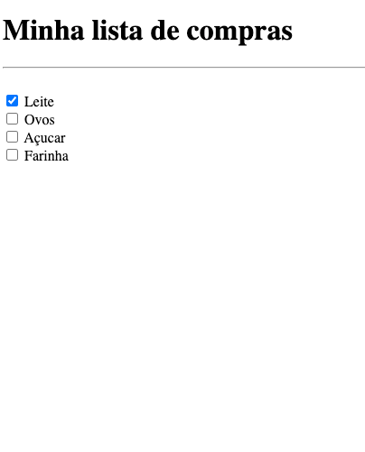

# 3. Lista de compras

# 💻 Sobre o desafio

---

Nesse exercício você deve criar uma lista de compras que tenha no mínimo 4 itens. 

Pode ser uma lista de compras de mercado, uma lista de itens que você deseja comprar, ou qualquer outro tipo de lista de compras.

## Iniciando o projeto

Primeiro vamos criar o arquivo HTML. Você pode dar qualquer nome para este arquivo, desde que use a extensão `.html`. Exemplo: **shopping-list.html** 

Para criar a estrutura base do HTML no Visual Studio Code, você pode digitar `!` e `TAB` em seguida. Feito isso, você vai ficar com uma estrutura parecida com o código abaixo:

```html
<!DOCTYPE html>
<html lang="en">
  <head>
    <meta charset="UTF-8" />
    <meta http-equiv="X-UA-Compatible" content="IE=edge" />
    <meta name="viewport" content="width=device-width, initial-scale=1.0" />
    <title>Lista de Compras</title>
  </head>
  <body>

  </body>
</html>
```

<aside>
💡 Lembre-se de dar um título para o documento usando a tag `<title>` 
`<title>Lista de Compras</title>`

</aside>

### Criando a lista

- A página deve ter um Título `h1` e um separador (`hr`) logo abaixo
- Cada item da lista deve ser um input do tipo `checkbox`
- O primeiro item deve estar marcado como `checked`

<aside>
❓ Veja essa aula sobre checkbox

[](https://app.rocketseat.com.br/node/formularios-de-outro-planeta/group/tags-de-entrada-de-dados/lesson/checkbox)

</aside>

## Como deve ficar a página ao final?

Ao finalizar o desafio você vai ter um resultado parecido com o da imagem abaixo. 

Lembrando que as imagens e textos abaixo são ilustrativos e você pode adicionar seu próprio conteúdo conforme as instruções acima. 


