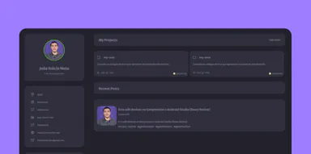
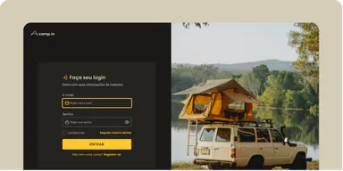
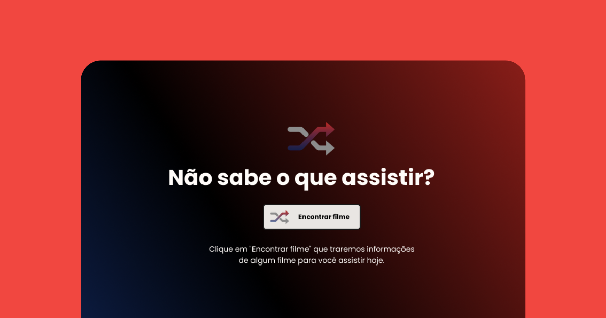

# Desafios Rocketseat

> A [Rocketseat](https://rocketseat.com.br/) apresenta uma variedade de desafios fazendo o uso das tecnologias HTML, CSS e JavaScript, e estão ao alcance de todos os níveis:

---

## Instruções📑:

* Use o Índice para navegar pela página.
* Clique nas imagens para aceder à webpage  do projecto.

`Divirta-se!🏳️‍🌈`

---

## Índice 🚀

### [Nível Iniciante](#iniciante)

* [Desafios HTML](#desafios-html)
* [Desafio: Social Tree](#social-tree)
* [Desafio: RocketNews](#rocketnews)
* [Desafio: Página de Receitas](#página-de-receitas)
* [Desafio: Portfolio](#portfolio)

### [Nível Intermediário](#intermediário) 

* [Desafio: Countdown](#countdown)
* [Desafio: Login From CSS](#login-from-css)

### [Nível Avançado](#)

---
---

 
 
 

# Iniciante

<section>

## Desafios HTML

___

> Esta é uma série de desafios básicos para praticar os conhecimentos em HTML.

</section>
<section>

## Social Tree

---
## 📸 [Captura de Ecrã](https://mellcosta.github.io/desafiosRocketseat/iniciante/assets/socialTree.PNG)

</section>

____

<section>

## RocketNews

---
## 📸 [Captura de Ecrã](https://mellcosta.github.io/desafiosRocketseat/iniciante/assets/rocket_news_mel.PNG)

</section>
<section>

## Página de Receitas

---
## 📸 [Captura de Ecrã](https://mellcosta.github.io/desafiosRocketseat/iniciante/assets/calulú.PNG)

</section>

____

<section>

## Portfólio

---
## 📸 [Captura de Ecrã](https://mellcosta.github.io/desafiosRocketseat/iniciante/assets/portfolioMel.PNG)

</section>

---
___

 
 
 

# Intermediário

<section>

## Countdown

---
## 📸 [Captura de Ecrã](https://mellcosta.github.io/desafiosRocketseat/intermediario/assets/countdownMel.PNG)

</section>
<section>

## Login From CSS

---
## 📸 [Captura de Ecrã](https://mellcosta.github.io/desafiosRocketseat/intermediario/assets/loginMel.PNG)

</section>

---
___

 
 
 

# Avançado

<section>

## Rocketflix

---
## 📸 [Captura de Ecrã](https://mellcosta.github.io/desafiosRocketseat/avancado/assets/rocketflixMel.png)

</section>

---
