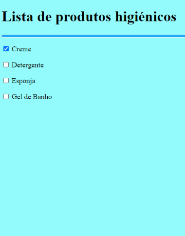
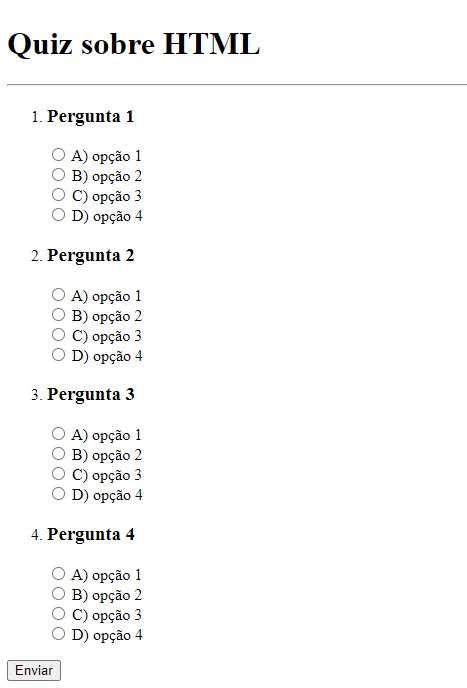
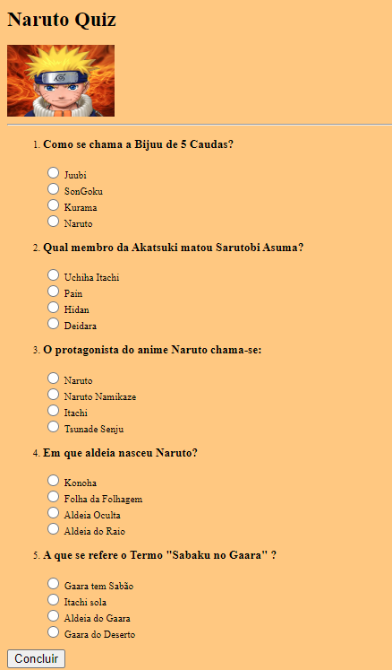
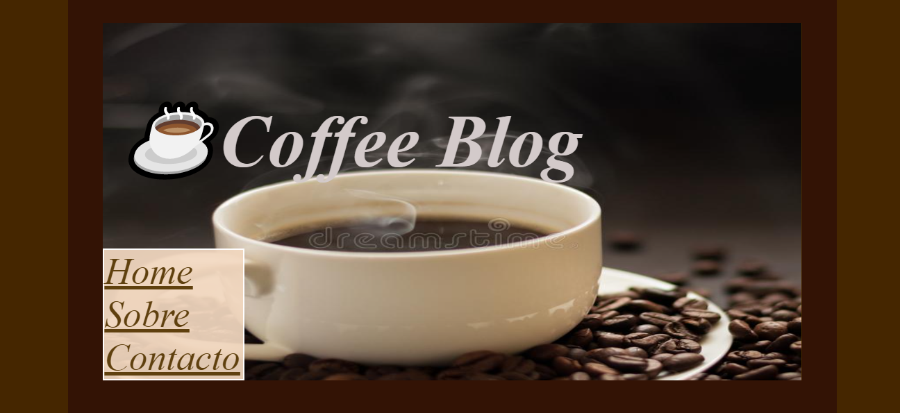

# Desafios [Rocketseat](https://rocketseat.com.br/)

> A ROCKETSEAT apresenta uma variedade de desafios desde o nível iniciante ao mais aperfeiçoado com o uso das tecnologias HTML, CSS e JavaScript.


# Desafios HTML

## 1. Glossário

### 💻 Sobre o desafio

---

Nesse desafio você deve criar um glossário com no mínimo 4 tags HTML e suas definições.


```
Modelo Proposto
```


```
Mel Design
```
<a href="./HTML/1.Gloss%C3%A1rio/glossary.html" target="_blank" >  </a>

---
---
<br>

## 2. Formulário de Contacto

### 💻 Sobre o desafio

---

Nesse desafio você vai criar um formulário para contato.

Para esse desafio, recomendamos que você assista ao curso [Formulários de Outro Planeta](https://app.rocketseat.com.br/node/formularios-de-outro-planeta), caso ainda não tenha assistido. 

```
Modelo Proposto
```


```
Mel Design
```


---
---
<br>

## 3. Lista de compras

### 💻 Sobre o desafio

---

Nesse exercício você deve criar uma lista de compras que tenha no mínimo 4 itens. 

Pode ser uma lista de compras de mercado, uma lista de itens que você deseja comprar, ou qualquer outro tipo de lista de compras.

```
Modelo Proposto
```


```
Mel Design
```


---
---
<br>

## 4.Quiz

### 💻 Sobre o desafio

---

Nesse desafio você deve criar um quiz de perguntas e respostas. 

Adicione no mínimo 3 perguntas com 4 opções de respostas cada. 

Você pode escolher qual o tema do quiz.


```
Modelo Proposto
```



```
Mel Design
```


## 5. Blog Post

### 💻 Sobre o desafio

---

Nesse desafio você deve criar a estrutura **HTML** para a página de post de um blog.

```
Modelo Proposto
```


```
Mel Design
```
