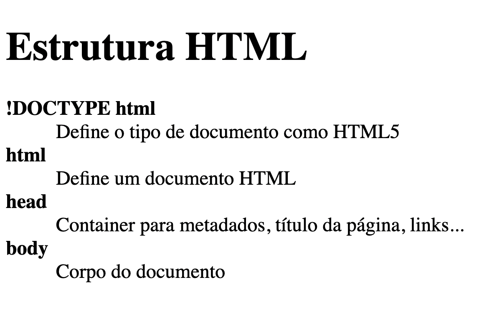

# 1. Glossário

# 💻 Sobre o desafio

---

Nesse desafio você deve criar um glossário com no mínimo 4 tags HTML e suas definições.

## Iniciando o projeto

Primeiro vamos criar o arquivo HTML. Você pode dar qualquer nome para este arquivo, desde que use a extensão `.html`. Exemplo: **glossary.html** 

Para criar a estrutura base do HTML no Visual Studio Code, você pode digitar `!` e `TAB` em seguida. Feito isso, você vai ficar com uma estrutura parecida com o código abaixo:

```html
<!DOCTYPE html>
<html lang="en">
  <head>
    <meta charset="UTF-8" />
    <meta http-equiv="X-UA-Compatible" content="IE=edge" />
    <meta name="viewport" content="width=device-width, initial-scale=1.0" />
    <title>Glossário</title>
  </head>
  <body>

  </body>
</html>
```

<aside>
💡 Lembre-se de dar um título para o documento usando a tag `<title>` 
`<title>Glossário</title>`

</aside>

### Criando uma lista de descrição

- Adicione um título para a página
    
    <aside>
    ❓
    
    [](https://app.rocketseat.com.br/node/o-guia-estelar-de-html/group/trabalhando-com-elementos/lesson/titulos-e-paragrafos)
    
    </aside>
    
- Para criar o glossário, você deve usar uma lista de descrição (`<dl>`)
    
    <aside>
    ❓ Veja mais sobre lista de descrição
    
    [](https://app.rocketseat.com.br/node/o-guia-estelar-de-html/group/trabalhando-com-elementos/lesson/lista-de-descricao)
    
    </aside>
    
- O termo da descrição deve estar em **negrito**
    - Bônus: o termo da descrição pode ser um link que leva para a documentação sobre o elemento HTML

## Como deve ficar a página ao final?

Ao finalizar o desafio você vai ter um resultado parecido com o da imagem abaixo. 

Lembrando que as imagens e textos abaixo são ilustrativos e você pode adicionar seu próprio conteúdo conforme as instruções acima.


### ~ 🌈🦄<a href="https://mellcosta.github.io/desafiosRocketseat/HTML/1.Gloss%C3%A1rio/glossary.html" target="_blank" >Click here</a> to see my design:
