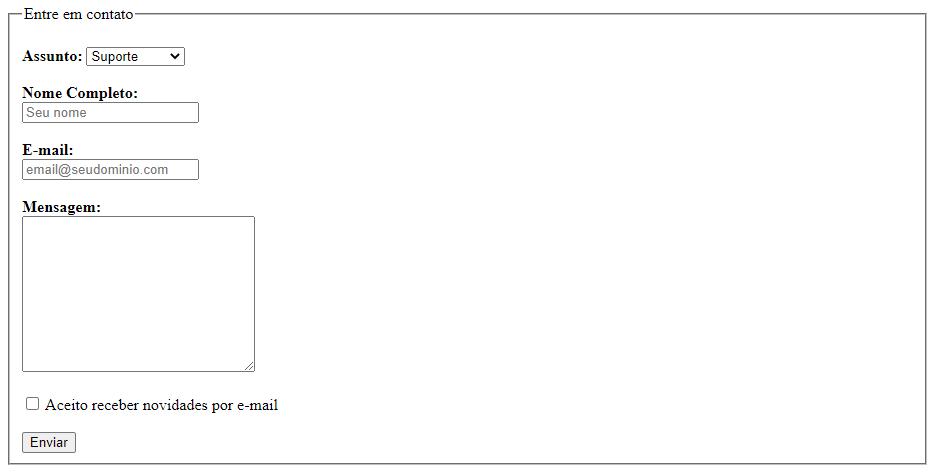

# 2. [Formulário de Contacto](https://mellcosta.github.io/desafiosRocketseat/iniciante/desafios_html/2_contact_form/contact_form.html)

## 💻 Sobre o desafio

---

Nesse desafio você vai criar um formulário para contato.

Para esse desafio, recomendamos que você assista ao curso [Formulários de Outro Planeta](https://app.rocketseat.com.br/node/formularios-de-outro-planeta), caso ainda não tenha assistido. 

## Iniciando o projeto

Primeiro vamos criar o arquivo HTML. Você pode dar qualquer nome para este arquivo, desde que use a extensão `.html`. Exemplo: **contato.html** 

Para criar a estrutura base do HTML no Visual Studio Code, você pode digitar `!` e `TAB` em seguida. Feito isso, você vai ficar com uma estrutura parecida com o código abaixo:

```html
<!DOCTYPE html>
<html lang="en">
  <head>
    <meta charset="UTF-8" />
    <meta http-equiv="X-UA-Compatible" content="IE=edge" />
    <meta name="viewport" content="width=device-width, initial-scale=1.0" />
    <title>Contato</title>
  </head>
  <body>

  </body>
</html>
```

<aside>
💡 Lembre-se de dar um título para o documento usando a tag `<title>` 
`<title>Contato</title>`

</aside>

### Criando o formulário

- Dentro do formulário adicione um `fieldset` com `legend` "Entre em contato"
- Adicione um `select` para que o usuário possa escolher o assunto do contato (ex: suporte, sugestão e reclamação)
- Adicione campos para que o usuário possa escrever seu **nome completo** e **e-mail**
    - Lembre-se de usar o `type` correto para cada tipo de input
- Adicione uma área de texto para que o usuário possa enviar uma **mensagem**
- Adicione um campo com um `checkbox` e o texto "Aceito receber novidades por e-mail"
- O formulário deve ter um botão "Enviar"

<aside>
💡 Para adicionar quebra de linha, você pode usar a tag `<br>` 
[https://developer.mozilla.org/pt-BR/docs/Web/HTML/Element/br](https://developer.mozilla.org/pt-BR/docs/Web/HTML/Element/br)

</aside>

## Como deve ficar a página ao final?

Ao finalizar o desafio você vai ter um resultado parecido com o da imagem abaixo. 

Lembrando que as imagens e textos abaixo são ilustrativos e você pode adicionar seu próprio conteúdo conforme as instruções acima.



