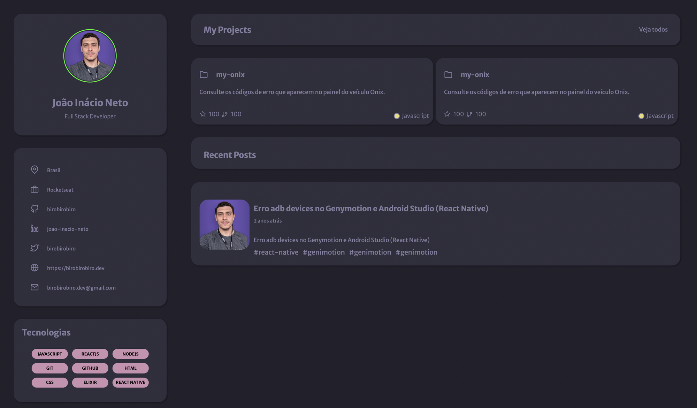

# Desafio Portfolio


## 💻 Sobre o desafio

---

Neste desafio você poderá criar uma página web para que seja seu portfolio e currículo. Utilizando HTML e CSS.

## Layout



Você pode duplicar o layout do projeto [clicando aqui](https://www.figma.com/file/L6fCiWtOgXCfslQdezqQeF/DD-Portfolio/duplicate) ou baixar o zip com os assets do projeto.

Baixe os assets aqui ⤵️

[assets.zip](https://s3-us-west-2.amazonaws.com/secure.notion-static.com/f928d510-0b8b-4a62-90b4-04e4046c00bd/assets.zip)

# 🚀 **Techs**

---

- HTML
- CSS

# 💡**Como começar?**

---

1 - Use o link do Figma como base para o projeto. Também disponibilizamos para download todos os assets necessários (imagens e ícones), para fazer o download basta clicar no link acima.  

2 - Leia com atenção todas as instruções do desafio.

3 - Bora codar! Lembre-se que você pode usar as tecnologias que se sentir mais confortável, mas também pode se desafiar usando novas techs, fazendo modificações e/ou adicionando funcionalidades no projeto como preferir. 🚀

4 - Compartilhe seu resultado ou tire suas dúvidas na nossa [**comunidade aberta**](https://discord.gg/bacwY2gDCF)  

# ✅ **Requisitos**

---

Neste desafio você vai construir o seu próprio portfolio. Caso você ainda não tenha feito os cursos do Discover ou queira fazer uma revisão, segue abaixo uma lista dos cursos que podem te ajudar a resolver este desafio.

- [O guia estelar de HTML](https://app.rocketseat.com.br/node/o-guia-estelar-de-html)
- [O guia estelar de CSS](https://app.rocketseat.com.br/node/o-guia-estelar-de-css)
- [Posicionando foguetes](https://app.rocketseat.com.br/node/posicionando-foguetes)
- [Formulários de outro planeta](https://app.rocketseat.com.br/node/formularios-de-outro-planeta)
- [Alinhando os planetas](https://app.rocketseat.com.br/node/flexbox)
- [App bonito, até nos textos](https://app.rocketseat.com.br/node/flexbox)

**Requisitos para o desafio:**

- Os cards dos projetos deverão ser clicáveis
- Os cards dos posts deverão ser clicláveis

***Se desafie também:***

- *Tornando o design responsivo*
- *Consumir a API do Github*

# 🎨 Style Guide

---

## **Cores:**

```css
:root {
  --body-bg-color: #22212C;
  --text-color: #837E9F;
  --bg-cards: #302F3D;
  --bg-techs: #CB92B1;
}
```

## **Tipo de fonte:**

font-family: Merriweather Sans 

font-weight: 400, 500 e 700

Você pode encontrar a fonte no [Google Fonts](https://fonts.google.com/specimen/Merriweather+Sans?query=Merriweather+Sans)