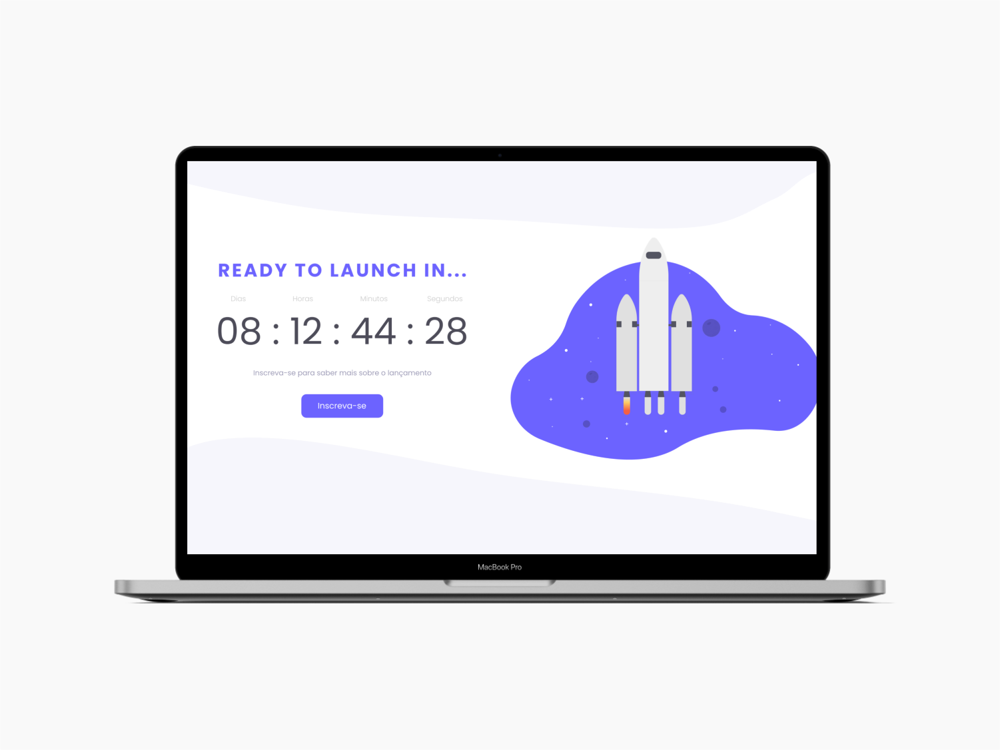

# Desafio Countdown 

## 💻 Sobre o desafio

---

Neste desafio você deve criar uma página de `coming soon` para o lançamento de um site, produto ou serviço, e na página deve ter um **countdown timer** informando quanto tempo falta para o lançamento.

## Layout



Você pode duplicar o layout do projeto [clicando aqui](https://www.figma.com/file/oDZqw3v8fem3v3RC7bTKV5/DD-%2F-Countdown/duplicate) ou baixar o zip com os assets do projeto.

Baixe os assets aqui ⤵️

[images.rar](https://s3-us-west-2.amazonaws.com/secure.notion-static.com/3e5c100d-5c5e-4634-acb7-25b205b191a2/images.rar)

# 🚀 **Techs**

---

- HTML
- CSS
- JavaScript

# 💡**Como começar?**

---

1 - Use o link do Figma como base para o projeto. Também disponibilizamos para download todos os assets necessários (imagens e ícones), para fazer o download basta clicar no link acima.  

2 - Leia com atenção todas as instruções do desafio.

3 - Bora codar! Lembre-se que você pode usar as tecnologias que se sentir mais confortável, mas também pode se desafiar usando novas techs, fazendo modificações e/ou adicionando funcionalidades no projeto como preferir. 🚀

4 - Compartilhe seu resultado ou tire suas dúvidas na nossa [**comunidade aberta**](https://discord.gg/bacwY2gDCF)  

# ✅ **Requisitos**

---

Neste desafio você vai construir um **countdown timer**. Caso você ainda não tenha feito os cursos do Discover ou queira fazer uma revisão, o curso [O guia estelar de JavaScript](https://app.rocketseat.com.br/node/o-guia-estelar-de-java-script) pode te ajudar a resolver este desafio.

**Requisitos para o desafio:**

- Para concluir o desafio você deve cumprir alguns requisitos:
    1. A página deve ter um **countdown timer** com uma contagem regressiva para o tempo de lançamento.
    2. Adicione um **botão** com o texto "inscreva-se".
- Neste desafio você é livre para criar seu próprio layout ou pode usar o layout disponibilizado acima como base.

***Se desafie também:***

- Adicione um modal que aparece quando o usuário clica no botão "Inscreva-se".
- No modal adicione um formulário com inputs de nome, e-mail e um botão de envio.

# 🎨 Style Guide

---

## **Cores:**

```css
:root {
  --black: #4D4C59;
  --purple: #6C63FF;
	--light-grey: #C8C8C8;
  --text-color: #9C9AB6;
}
```

## **Tipo de fonte:**

font-family: Poppins 

Font Weight: 300, 400 e 500

Você pode encontrar a fonte no [Google Fonts](https://fonts.google.com/) 
